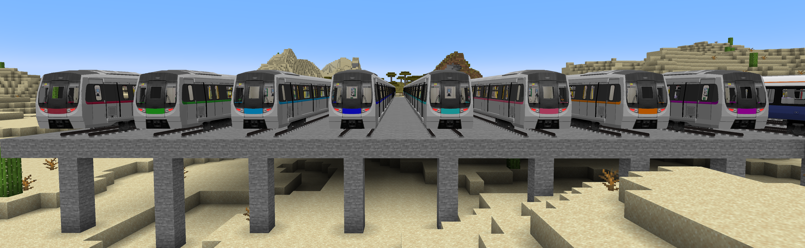
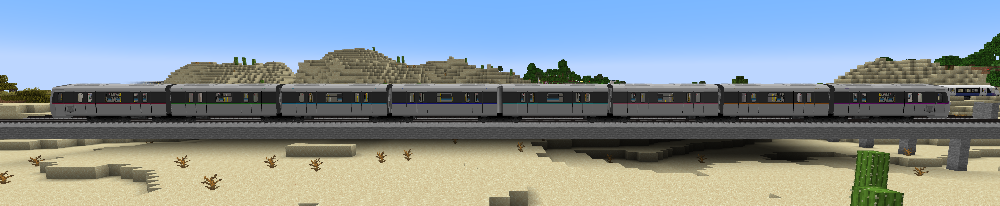

# C-Train多彩列车包

MTR-C-train_Color-Park是一个为[Minecraft-Transit-Railway](https://github.com/Minecraft-Transit-Railway/Minecraft-Transit-Railway) MOD设计的资源包，增加了更多的C-Train列车腰线颜色。



## 增添更多颜色：

资源包使用了[原版Minecraft-Transit-Railway模组的C-Train红色腰线贴图](https://github.com/Minecraft-Transit-Railway/Minecraft-Transit-Railway/blob/master/fabric/src/main/resources/assets/mtr/textures/vehicle/c_train.png)为基础，新增了7种颜色：

- 绿色：森林绿`#228B22`

- 深蓝色：深海蓝`#0000FF`

- 浅蓝色：天空蓝`#00a2e1`

- 青色：薄荷青`#00FFFF`

- 粉色：樱花粉`#f8779e`

- 橙色：琥珀橙`#FF8000`

- 紫色：葡萄紫`#800080`



## 支持多种车型：

- 普通车：5门4窗
- 小型车：4门3窗
- 迷你车：2门1窗

## 兼容性：

兼容3.1.0以上的Mod版本与所有支持[Minecraft-Transit-Railway](https://github.com/Minecraft-Transit-Railway/Minecraft-Transit-Railway) 3.1.0以上Minecraft版本

原版支持1.16.5，如果你使用的为其他版本可修改pack.mcmeta文件解决

## 如何安装

### 下载最新Releases

1. 下载最新Releases中与资源包相同名称的的zip文件

2. 复制到Minecraft的`resourcepacks`目录中，请确保Minecraft-Transit-Railway已正常运作

3. 在游戏中启用此资源包

### 本地手动打包

1. Git Clone本仓库

2. 将`src`​文件夹的以下内容打包为ZIP文件并复制到Minecraft的`resourcepacks`目录中：
   
   ```language
   resource_pack/
   ├── pack.mcmeta
   ├── pack.png
   └── assets/
      └── mtr/
          ├── mtr_custom_resources.json
          └── custom_directory/...    
   ```

3. 在游戏中启用此资源包

4. 确保已安装MTR模组

### packup.py打包

这是一个使用python编写的一个打包程序。
#### 如何使用

为确保运行正常，会要求下的没有旧的tmp会packup文件夹，如果有会请求是否删除（如果输入y将会删除文件夹，输入n或任意键将停止运行），之后填写需要打包的版本号即可在packup目录下看到打包好的所有版本

#### 扩展

如果需要添加更多的版本支持，可在程序中的`pack_format字典`中添加版本和pack_format数值即可

## 许可证

本项目采用MIT许可证。详见[LICENSE](LICENSE)文件。
